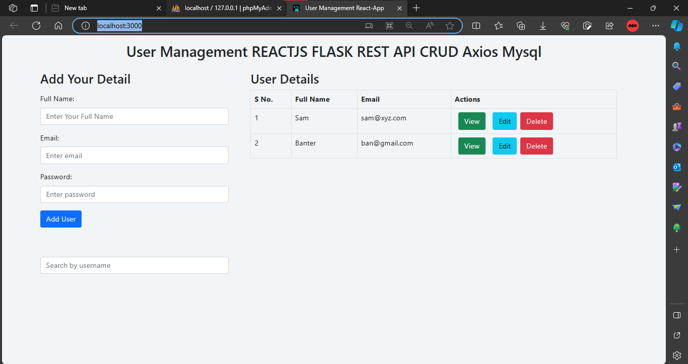

# 🚀 Flask-React User Management System

A full-stack web application for user management built with Flask, React, and MySQL.





## Features

- **User Registration:** Add new users with details like name, email, and password.
- **User Listing:** View a list of all users with options for individual actions.
- **User Details:** View, update, and delete user details.
- **Search Users:** Search for users by entering their name to check existence and view details.
- **Client-Side Validation:** Form validations to ensure input fields are not empty, email follows the correct format, and passwords meet requirements.

## Technologies Used

- **Frontend:** React.js, Bootstrap 5
- **Backend:** Flask (Python), REST API
- **Database:** MySQL (XAMPP)
- **Additional Libraries:** Flask-SQLAlchemy, Flask-CORS, Flask-Marshmallow, PyMySQL
- **External Dependencies:** Axios, React-Router-DOM, Validator

## Installation

1. Install backend dependencies:

    ```bash
    cd flaskreact
    python -m venv venv
    .\venv\Scripts\Activate
    pip install Flask Flask-SQLAlchemy Flask-CORS Flask-Marshmallow PyMySQL
    ```

2. Install frontend dependencies:

    ```bash
    npx create-react-app reactclient
    npm install axios react-router-dom validator
    ```

3. Set up MySQL database using XAMPP.

4. Run the Flask backend:

    ```bash
    flask run
    ```

5. Run the React frontend:

    ```bash
    npm start
    ```

## Usage

1. Access the application at [http://localhost:3000](http://localhost:3000).
2. Navigate through the different features like user registration, listing, details, and search.
3. Ensure to fill out forms correctly, following the client-side validation rules.

## Folder Structure

- `/flaksreact`: Contains Flask backend files.
- `/reactclient`: Houses the React.js frontend components.

## Important API Endpoints

- **List Users**
  - **Endpoint:** `/users`
  - **Method:** `GET`
  - **Description:** Get a list of all users.

- **User Details**
  - **Endpoint:** `/userdetails/<id>`
  - **Method:** `GET`
  - **Description:** Get details of a specific user by providing their ID.

- **Update User**
  - **Endpoint:** `/userupdate/<id>`
  - **Method:** `PUT`
  - **Description:** Update details of a specific user by providing their ID. Requires JSON payload with updated information.

- **Delete User**
  - **Endpoint:** `/userdelete/<id>`
  - **Method:** `DELETE`
  - **Description:** Delete a specific user by providing their ID.

## Author

- **ANAND B**
  - GitHub: [Anand5013](https://github.com/Anand5013)
